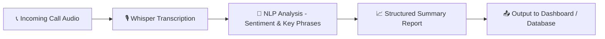

# 📞 AI Call Analysis System

## 🧠 Overview
This project implements an **AI-powered call analysis system** that:
1. **Receives customer calls**
2. **Transcribes the audio to text** using OpenAI Whisper
3. **Analyzes the sentiment and tone** of the conversation
4. **Extracts key insights and phrases**
5. **Generates a structured report** summarizing customer mood, intent, and key discussion points

The system is designed for **call centers, sales teams, and customer service analytics**, providing valuable insights for performance improvement and customer satisfaction monitoring.

---

## 🚀 Features
- 🎧 **Automatic Speech Recognition (ASR)** using OpenAI Whisper  
- 💬 **Sentiment Analysis** on the transcribed conversation  
- 🔑 **Key Phrase Extraction** to identify important moments or customer concerns  
- 📊 **Automated Reporting** summarizing call quality and customer emotions  
- 🧩 **Modular Design** — easy to integrate with other analytics or CRM systems  

---

## 🏗️ Project Architecture

---

## 🛠️ Tools & Technologies

| Category | Tools / Libraries |
|-----------|------------------|
| 🗣️ Speech-to-Text | [OpenAI Whisper](https://github.com/openai/whisper) |
| 💬 NLP & Sentiment Analysis | [LangChain](https://www.langchain.com/), [Transformers](https://huggingface.co/docs/transformers), [Hugging Face](https://huggingface.co/) |
| 🤖 LLM Integration | [OpenAI GPT models](https://platform.openai.com/docs/models) |
| 🧮 Data Handling | [Python](https://www.python.org/), [Pandas](https://pandas.pydata.org/) |
| 💻 Environment | [Jupyter Notebook](https://jupyter.org/), [Google Colab](https://colab.research.google.com/) |

---

## 🧩 Main Components

| File | Description |
|------|--------------|
| `Call_Analysis.ipynb` | Main notebook containing transcription, analysis, and reporting logic |
| `audio_samples/` | Folder containing input audio calls |
| `results/` | Folder where analysis reports are saved |

---

## 💡 How It Works

1. 🎧 **Upload or record a call (audio file)**
2. 🗣️ The system **transcribes the audio** using **Whisper**
3. 🤖 The transcription is **passed to an AI agent** (via LangChain or a custom NLP pipeline)
4. 🧠 The agent performs:
   - Sentiment analysis  
   - Key phrase extraction  
   - Summary generation
5. 📊 The **final structured analysis** is returned as a detailed report

---

## 🧪 Example Output

**Input Audio:** `customer_support_call.wav`  
**Transcription:** “Hello, I’m having an issue with my recent order...”  
**Sentiment:** 😟 Negative  
**Key Phrases:** “issue with recent order”, “need refund”  
**Summary:** The customer expressed dissatisfaction regarding a product issue and requested a refund.
